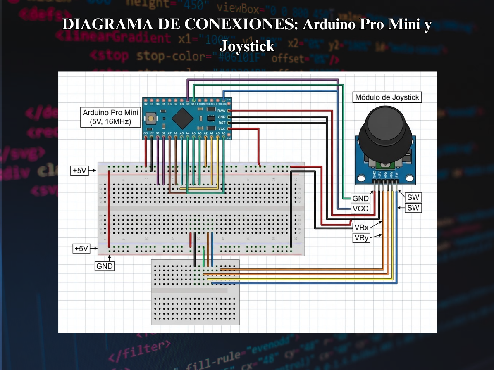

# ── 𖦹 ── · 𖥻 Control Arcade Personalizado - iKe-GO Showdown ฅ^._.^ฅ

── 𖦹 ── · 𖥻 ִ ۫ ּ ₊ ⊹ 𓏲 ๋ 🐱  𐐪𐑂 ₍ᐢ. ̫.ᐢ₎ ── 𖦹 ──

##  Descripción del Proyecto

Este proyecto consiste en el diseño, ensamblaje y programación de un controlador arcade físico basado en hardware libre. Permite enviar señales de entrada rápidas y de baja latencia simulando eventos de teclado USB para juegos de pelea en tiempo real. 🐾

El circuito integra un Arduino Pro Micro/Leonardo, un joystick analógico de dos ejes y sensores físicos montados sobre protoboard para registrar los movimientos del jugador de manera precisa.

 

── 𖦹 ── · 𖥻 ִ ۫ ּ ₊ ⊹ 𓏲 ๋   ˚ ༘ ೀ

##  Propósito del Proyecto

El objetivo principal es crear una interfaz de control directa para evaluar la respuesta de los componentes físicos (joystick, botones y sensores) en entornos de juego. (˶˃ᆺ˂˶)

Para probar y validar el funcionamiento del control se utiliza **Ikemen GO** (motor de juego de peleas basado en MUGEN), donde además se integran y modifican escenarios y personajes personalizados. El juego actúa como entorno de prueba para medir la precisión y velocidad de respuesta del hardware en combate. 

── 𖦹 ── · 𖥻 ִ ۫ ּ ₊ ⊹ 𓏲 ๋ ⋆ ˚ ｡ ⋆ ୨୧ ˚ ⋆

##  Herramientas y Materiales Utilizados

*  **Hardware:**
  * Placa de desarrollo compatible con HID (Arduino Pro Micro / Leonardo)
  * Módulo de Joystick analógico de 2 ejes (VRx / VRy / SW)
  * Sensor de choque / golpe (Shock sensor)
  * Placa de pruebas (Protoboard) y cables Jumper

*  **Software:**
  * Arduino IDE (Entorno de desarrollo y carga de firmware)
  * Ikemen GO / Engine MUGEN (Motor de prueba e integración)
  * Git & GitHub (Control de versiones y documentación)

── 𖦹 ── · 𖥻 ִ ۫ ּ ₊ ⊹ 𓏲 ๋  

##  Mapa de Conexiones (Tabla de Pines) ฅ^._.^ฅ

> ┌───────────────────────────┬──────────────────────┬────────────────┬──────────────────────────────────────────┐  
> │ **Componente**            │ **Pin Componente**   │ **Pin Arduino**│ **Función en Juego / Tecla**             │  
> ├───────────────────────────┼──────────────────────┼────────────────┼──────────────────────────────────────────┤  
> │ **Joystick (VRx)**        │ Salida Analógica X   │ **A0**         │ Movimiento Izquierda / Derecha (`A`/`D`) │  
> │ **Joystick (VRy)**        │ Salida Analógica Y   │ **A1**         │ Movimiento Arriba / Abajo (`W`/`S`)      │  
> │ **Joystick (SW)**         │ Botón de presión     │ **Digital 3**  │ Botón de Ataque / Selector (`X`)         │  
> │ **Sensor de Golpe**       │ Señal Digital (OUT)  │ **Digital 9**  │ Ataque Especial por Impacto (`Z`)        │  
> │ **VCC (Todos)**           │ Alimentación         │ **5V**         │ Energía positiva para sensores           │  
> │ **GND (Todos)**           │ Tierra común         │ **GND**        │ Masa común                               │  
> └───────────────────────────┴──────────────────────┴────────────────┴──────────────────────────────────────────┘  

── 𖦹 ── · 𖥻 ִ ۫ ּ ₊ ⊹ 𓏲 ๋  

##  Instrucciones de Instalación y Configuración

1.  **Montaje Físico:** Conectar el joystick y el sensor de golpe al Arduino respetando el esquema del diagrama y la tabla de conexiones.
2.  **Carga del Firmware:**
   * Abrir el archivo `main.ino` en Arduino IDE.
   * Seleccionar la placa **Arduino Leonardo / Micro** en el menú *Herramientas*.
   * Compilar y subir el programa a la placa.
      **Prueba en Ikemen GO:**
   * Conectar el controlador por USB al PC.
   * Iniciar Ikemen GO y acceder a *Options > Key Config*.
   * Mapear las teclas enviadas por el control (`W`, `A`, `S`, `D`, `X`, `Z`) a las acciones deseadas.

---

(=^‥^=) ¡Listo para jugar! (🐾˘ω˘🐾)

